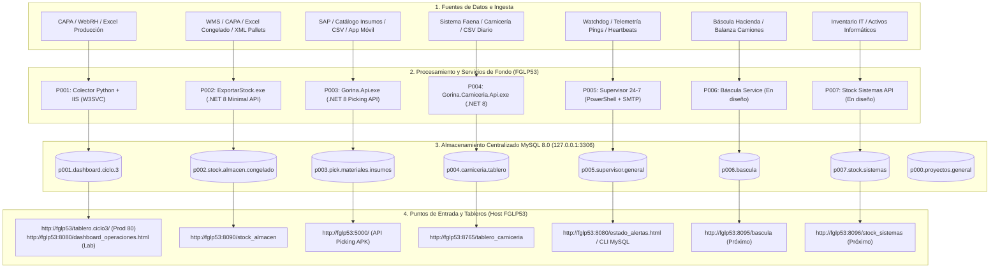

# Mapa Maestro de Flujos, Ingesta, Almacenamiento y Accesos — Espacio de Proyectos Gorina

Este documento detalla la arquitectura completa de los proyectos (**P000 a P007**), especificando el origen de los datos, los motores de procesamiento, las bases de datos en MySQL 8.0 local y las URLs de acceso corporativo a través del host **`FGLP53`**.

---

## 1. Diagrama General de Arquitectura y Flujos

---

## 2. Matriz Detallada por Proyecto

| Proyecto | Ubicación en Disco | Origen de Datos (Ingesta) | Base de Datos MySQL | URL de Acceso Corporativo (`FGLP53`) | Backend / Motor | Tarea de Fondo / Auto-Inicio |
|---|---|---|---|---|---|---|
| **P001.Dashboard.Ciclo.3** | `D:\PROYECTOS\P001.Dashboard.Ciclo.3\` | WebRH / CAPA / Archivos Excel de desposte y producción | `` `p001.dashboard.ciclo.3` `` | **Producción:** `http://fglp53/tablero.ciclo3/dashboard_operaciones.html` **Laboratorio:** `http://fglp53:8080/dashboard_operaciones.html` | IIS 10 + Python 3.12 (Colector de datos) | `Gorina LAB - Colector datos` (Cada 5 min) + Servicio Windows `W3SVC` |
| **P002.Stock.Almacen.Congelado** | `D:\PROYECTOS\P002.Stock.Almacen.Congelado\` | CAPA / Exportaciones Excel diarias / Catálogo SKUs / *Próximo: Mensajes XML de ingreso/egreso de pallets* | `` `p002.stock.almacen.congelado` `` | **Tablero Stock:** `http://fglp53:8090/stock_almacen` **Ping API:** `http://fglp53:8090/stock_almacen/ping` | C# .NET 8 (`ExportarStock.exe`) + Streaming CSV Engine | `Gorina - Stock Almacen 24-7` (Inicio con Windows `AtStartup`) |
| **P003.Pick.Materiales.Insumos** | `D:\PROYECTOS\P003.Pick.Materiales.Insumos\` | Catálogo SAP / Archivos de insumos y materiales / App Móvil Android (APK Picking) | `` `p003.pick.materiales.insumos` `` | **API Picking:** `http://fglp53:5000/api/materiales` **Salud API:** `http://fglp53:5000/api/ping` | C# .NET 8 (`Gorina.Api.exe`) Minimal API | `Gorina - GorinaPick API 24-7` (`vigilante_gorina_api.ps1`, `AtStartup` + cada 5 min) |
| **P004.Carniceria.Tablero** | `D:\PROYECTOS\P004.Carniceria.Tablero\` | Planillas diarias de faena y carnicería (`.xlsx` / `.csv` procesados) | `` `p004.carniceria.tablero` `` | **Tablero Carnicería:** `http://fglp53:8765/tablero_carniceria` **API Estado:** `http://fglp53:8765/api/estado` | C# .NET 8 (`Gorina.Carniceria.Api.exe`) + Static SPA | `Gorina - Carniceria Tablero 24-7` (`vigilante_carniceria.ps1`, `AtStartup` + cada 5 min) |
| **P005.Supervisor.General** | `D:\PROYECTOS\P005.Supervisor.General\` | Telemetría HTTP en vivo de puertos 80, 8080, 8090, 5000, 8765 + Estado de Tareas Windows | `` `p005.supervisor.general` `` | **Reporte CLI:** `2_VER_ESTADO_DE_ALERTAS.bat` **Diagrama:** `http://fglp53/tablero.ciclo3/1_DIAGRAMA_Y_MANUAL.html` | PowerShell Core / Scripts de Vigilancia + Relay SMTP (`192.168.0.234`) | `Gorina - Supervisor General 24-7` (`supervisor_servicios_24-7.ps1`, `AtStartup` + cada 3 min) |
| **P006.Bascula** | `D:\PROYECTOS\P006.Bascula\` | Terminales de pesaje de hacienda / Balanza de camiones (puerto serie / red) | `` `p006.bascula` `` | **Panel Báscula:** `http://fglp53:8095/bascula` *(a configurar)* | .NET 8 / Python *(fase de diseño)* | Tarea Windows dedicada *(próxima implementación)* |
| **P007.Stock.Sistemas** | `D:\PROYECTOS\P007.Stock.Sistemas\` | Inventario de hardware, insumos informáticos, licencias y periféricos IT | `` `p007.stock.sistemas` `` | **Panel IT:** `http://fglp53:8096/stock_sistemas` *(a configurar)* | .NET 8 / Web *(fase de diseño)* | Tarea Windows dedicada *(próxima implementación)* |
| **P000.Proyectos.General** | `D:\PROYECTOS\` | Consolidación y auditoría de todos los proyectos P001 a P007 | `` `p000.proyectos.general` `` | **Orquestador Global:** `http://fglp53/proyectos` *(a configurar)* | Consola centralizada y dashboard de auditoría | Orquestador unificado de servicios |

---

## 3. Resumen de Puertos y Servicios de Red en `FGLP53`

| Puerto | Protocolo / Host | Servicio Asociado | Estado |
|---|---|---|---|
| **80** | `http://fglp53/tablero.ciclo3/` | P001 Dashboard Producción (IIS) | Activo 24/7 |
| **8080** | `http://fglp53:8080/` | P001 Dashboard LAB (IIS) | Activo 24/7 |
| **8090** | `http://fglp53:8090/stock_almacen` | P002 Stock Almacén (.NET 8) | Activo 24/7 |
| **5000** | `http://fglp53:5000/` | P003 GorinaPick API (.NET 8) | Activo 24/7 |
| **8765** | `http://fglp53:8765/tablero_carniceria` | P004 Carnicería Tablero (.NET 8) | Activo 24/7 |
| **3306** | `127.0.0.1:3306` (Localhost) | Servidor MySQL 8.0 Community | Activo (Servicio `MySQL80`) |
